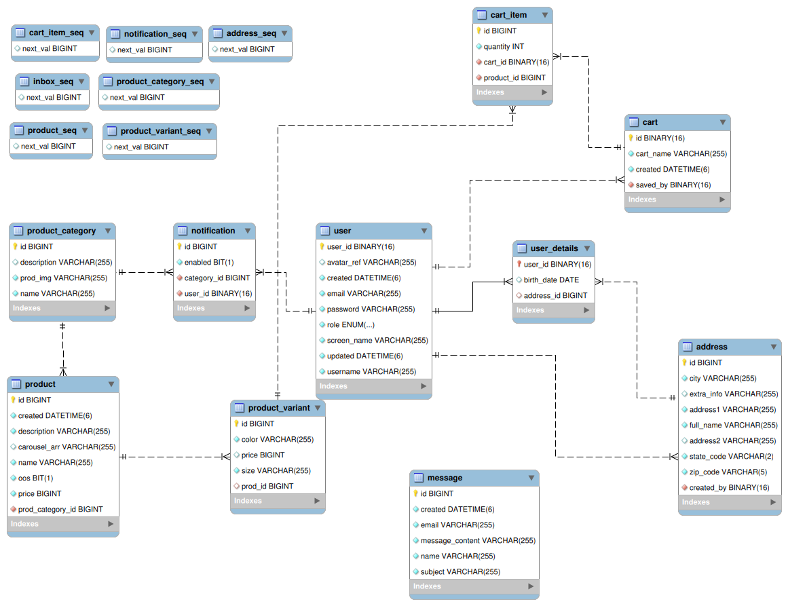

# Spring-Based Storefront Backend

This is an implementation of the backend that would be used with [this](https://github.com/BrianMH/ExampleNextJSStorefrontFrontEnd) frontend
example on the other repository. Unlike the front-end, the back-end currently has no
security associated with it, but conveniently the only API that would be transparent
to the end-user would be the products API (as the avatar links are hidden through
Next.JS' serving page).

# Model Schema



The schema itself was designed to accommodate storing a user's information along with
potential shipping information, saved cards, products and their variants, and
product categories. At least in theory, it should support all the basic functions
I sought out to implement, but due to a bit of time constraints a few services have
yet to be implemented (this will be touched on at the end).

# Service Routes

I messed up with the route planning and now the earliest implemented service (```/messages/*```) 
does not fall into line with the rest of the API routes that look more like ```/api/[ROUTE]/*```.

Either way, the following routes had all functions that were designed for them implemented:

* Address (@```/api/addresses```)
* Notification (@```/api/nofitications```)
* Message (@```/messages```)
* User (@```/api/users```)

While the following are only partially implemented:

* Product (@```/api/products```)
* ProductCategory (@```/api/categories```)

And the following still require proper implementation:

* Cart (@```/api/carts```)
* CartItem (@```/api/cartitems```)
* UserDetails (@```/api/userdetails```)

Most of these routes I at least tried to adhere to a typical response that would be
expected of a REST API, but on any operations that would typically return NO_CONTENT,
I figured it would be more useful to return a DTO that represented the success of the
operation instead. Encountered exceptions would then also be used to route these ResultDTO's
to the front end where they could be checked via attribute names.

## Complications

* Like with the front-end, this was my first time using Spring, and one thing that I immediately noticed
was that a model mapper would be called once on nearly every service component. While it likely
doesn't increase overhead by a significant amount, it does seem to violate the principles of
DRY and I would have liked to incorporated it via a bean instead (since none use any special operations).
* Array-like storage is a bit odd to implement. Currently, a carousel array is stored as a URI separated
by a character that is illegal in any URI (or null if unset). It seemed to work just fine, but
MySQL doesn't seem to enjoy being used to keep an ordered list (and the overhead from
creating a LinkedList using recursive self-joins didn't sound like the right way to approach this).
* Security was not implemented on this end (but it should be for the few routes used on
the client end). Most of the security was deferred to the front-end server, but it couldn't
hurt to use more.
* I noticed many used DTOs seem to ensure proper deletion by comparing all entries of a passed
DTO with the item to delete before deletion. I chose not to adhere to that, but in principle
that would be a significantly "safer" deletion operation.
  * Insofar as deletions are concerned, most people would rather not even delete it and instead
  set a marker for a deletion date and refuse sending that data.